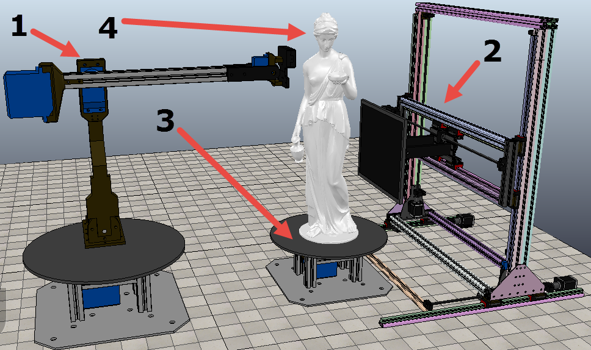

# Robot motion with V-REP

Models of robotic system that design in V-REP system to solve pathfinding and motion planning tasks in the space with obstacles

A few example models that I've developed on the last course in the University. [V-REP][vrep] system is used to solve inverse and forward kinematics tasks of together motion two robots. The designed models are showing the features of the system for modeling pathfinding and robot motion dynamics in the space with obstacles. It are simulation of the real robotic system that need to get x-ray photos of a detail.

These models consist of two main robots is a manipulator (in the picture it is a "1") and a frame robot ("2"). Also has a table robot ("3") that rotates a detail ("4").

All developed models is placed [here](v-rep%20models/) and its description is described [here].
And [here](images/) you can find some funny images of ones. The video of a scan simulation of a detail is [here](https://youtu.be/yxw9i_CwjF0).

## Built with
  - V-REP PRO EDU [3.4.0](http://www.coppeliarobotics.com/helpFiles/en/versionInfo.htm#3.4.0) _(April 6th 2017)_

## Author
  - _Ruslan Gainanov_

## License

This project is licensed under the MIT License - see the [LICENSE](LICENSE) file for details.

[vrep]: http://www.v-rep.eu/